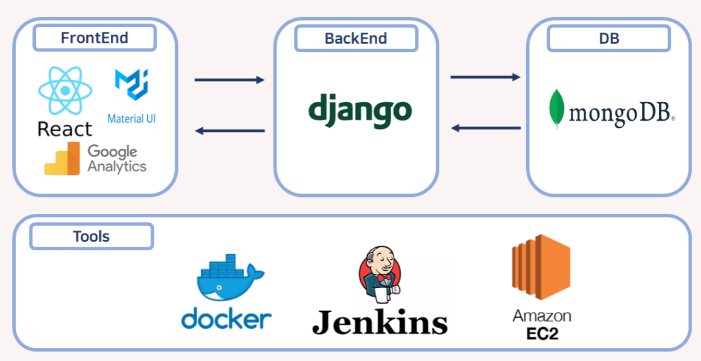
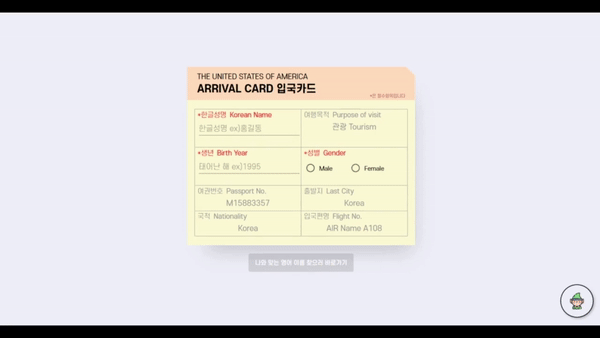
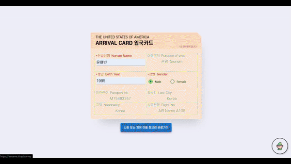
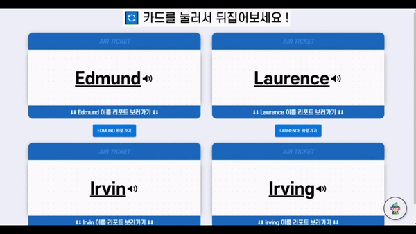

# README.md

# 🛫 AirName 🛬

### 여러분의 영어이름은 무엇인가요? 나에게 딱맞는 영어이름을 가져보세요!

빅데이터 기반 영어 이름 추천 서비스

<aside>
📝 한글 이름, 성별, 생년, 그리고 원하는 분위기를 설문으로 받아 600만개의 영어 이름 중 제일 맞는 이름을 추천해준다.

</aside>

---

### 기술 스택

- **FrontEnd**
    
    <div style="display: flex; align-items: flex-start;"></div>
    
- **BackEnd**
    
    <div style="display: flex; align-items: flex-start;"></div>
    
- **CI/CD**
    
    <div style="display: flex; align-items: flex-start;"></div>
    

---

### 아키텍쳐



---

### 서비스 소개

##### 1. 메인 화면


```
> 여행을 컨셉으로 하여 비행기 안에서 창문 밖을 바라보는 컨셉으로 메인 화면을 디자인

- 영어 이름이 없다면 :
  기본 정보를 입력받아 영어 이름을 추천하는 과정을 거쳐 리포트 생성

- 영어 이름이 있다면 :
  기본 정보에 영어 이름을 추가적으로 입력받아 리포트 바로 생성

- 카카오톡으로 웹페이지 주소를 공유해 친구와 같이 할 수 있도록 설정했으며 우측 하단 요정 아이콘을 클릭하면
  FAQ를 통해 건의사항을 받을 수 있는 구글 질문 폼으로 이동
```

##### 2. 기본 정보 기입



```
> 사용자의 기본 정보를 받아오는 것이 착륙 시 적는 입국카드와 유사하다고 생각하여 입국카드와 같은 모습으로 UI를 구성

- 영어 이름이 없는 상태
  - 한글성명, 생년, 성별 입력 받음
  - 나와 맞는 영어 이름 찾으러 바로가기: 원하는 분위기를 설문하는 페이지로 이동
- 영어 이름이 있는 상태
  - 한글성명, 영어이름, 생년, 성별 입력 받음
  - 내 영어 이름 리포트 보러 바로가기: 내 영어 이름 레포트를 보기 전 로딩페이지로 이동 
```

##### 3. 설문 조사



```
> 입국 심사할 때 질문을 받는 컨셉으로 설문 조사 기능을 디자인

- 다양한 질문을 통해 사용자의 분위기(성향)을 파악해 이후 이름 추천하는데 사용
- 질문은 12가지 질문 중 랜덤하게 6가지의 질문이 주어짐
```

##### 4. 로딩페이지

```
> 600만개의 영어 이름 중 추천하는 시간/영어 이름에 대한 레포트를 생성하는 시간동안 지루하지 않도록 3개의 로딩 페이지 구성

- 반응속도 테스트
- 이름과 관련된 흥미로운 TMI
- 주어진 영어 이름에 대해 자신이 생각하는 이미지를 선택하는 게임
```

##### 5. 영어 이름 추천



```
> 자신의 한글 이름 발음을 기반으로 비슷한 영어 발음을 가지는 이름 2가지와 설문 조사 기반으로 비슷한 분위기를 가지는 이름 2가지 추천

- 스피커 아이콘을 누르면 영어 이름을 읽어주는 tts 기능 구현
- 이름 카드를 뒤집으면 해당 이름에 대한 추천 이유와 이름에 대한 간단한 통계 자료를 제공
```

##### 6. 이름 리포트


```
> 비행기 티켓 컨셉으로 이름 리포트 페이지를 구현

- 상단에는 해당 이름이 가장 많이 사용된 미국 주(state)의 이름과 해당 주에서 유명한 장소를 백 그라운드 이미지로 제공
- 중단에는 여권 컨셉으로 추천받은 이름에 대한 리포트를 제공해주며, QR코드를 찍으면 이스터에그로 팀 프로젝트 당시 사용한
  notion 페이지로 이동하는 기능 구현
- 하단에는 추천받은 이름에 대한 상세한 리포트를 제공 연도별 이름 사용 추이와 이름의 뜻, 자주 사용된 주(state),
  동일 이름을 가진 유명인을 소개
```

---

### 산출물
|산출물 링크 목록|
| --- |
| [API 명세서](./exec/API.md) |
| [와이어프레임](https://www.figma.com/file/I0epgC5hybkQafS89sycjy/%EC%97%AD%EC%82%BC%EC%B2%A0%ED%95%99%EA%B4%80?t=IMkPoKZhuJFIOQS8-6) |
| [UCC](./exec/ucc.mp4) |

---

### 팀원

| Backend | Backend | Backend |  Backend | Frontend | Frontend |
| --- | --- | --- | --- | --- | --- |
|  |  | | | | |
| [조민제](https://github.com/minje0204)| [김상협](https://github.com/rotter9027) | [전선영](https://github.com/sally2596)| [윤여빈](https://github.com/YunYeoBeen)  | [염수홍](https://github.com/2riing) | [정지은](https://github.com/zzz0105) |
